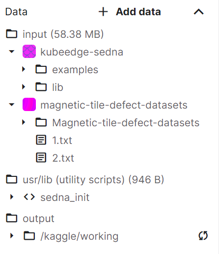

## “在线课程”联邦学习场景

## 操作步骤

### 整体操作说明
* 老师[启动云端aggregation worker服务](#老师启动云端aggregation-worker服务)
* 学生1[启动边侧training worker](#学生启动边侧training-worker在kaggle上)。
* 学生2[启动边侧training worker](#学生启动边侧training-worker在kaggle上)。
* ...
* 学生n[启动边侧training worker](#学生启动边侧training-worker在kaggle上)。

### 老师：启动云端aggregation worker服务
TIPS:
* 老师课前准备好即可，无需每次准备。
* **当前已经准备好一个aggregation worker service.**
  * 聚合算法: fedavg
  * 训练算法：一个简单的十几层卷积网络
  * **ip&port: 159.138.44.120:30363**
* 如果需要修改aggregation worker service, 才需要参考本节内容。包括：
  * aggregation worker service参数
    * 聚合算法
    * 训练算法
    * 模型保存地址

0. 克隆分支
```shell
cd ~
git clone https://github.com/jaypume/sedna.git
cd sedna
git checkout feature-online-course
```

1. 构建镜像
```shell
bash examples/build_image.sh federated_learning
```
2. 启动aggregation worker
```shell
kubectl apply -f examples/federated_learning/online_course/online-course-aggregation-deployment.yaml
```
 
3. 查看启动的aggregation worker pods
```shell 
kubectl get pods -n online-course
```

4. 查看aggregation worker pods的日志：
```shell
kubectl logs -f online-course-aggregation-5f79ddb6df-v54lz -n online-course
```

删除aggregation worker:(当前步骤无需操作，仅供参考)
```shell
kubectl delete -f examples/federated_learning/online_course/online-course-aggregation-deployment.yaml
```

### 学生：启动边侧training worker（在kaggle上）
1. 打开提前准备好的kaggle notebook:[sedna-federated-learning](https://www.kaggle.com/jaypume/sedna-federated-learning) ，fork一份.
2. 通过环境变量配置aggregation worker服务信息：
   * local training客户端ID配置
   * aggregation worker服务地址配置
3. 在kaggle notebook执行`Run All`


#### Notebook说明

* `kubeedge-sedna`是sedna提供的库函数，作为kaggle的Dataset导入到`sedna-federated-learning`notebook中。
* `magnetic-tile-defect-datasets`是`sedna-federated-learning`notebook在本地使用的数据集：
  * 子目录`Magnetic-tile-defect-datasets`包含原始图片。
  * `1.txt`和`2.txt`是手动分割好的数据集，分别给联邦学习不同训练客户端使用。
* `user/lib`暂时没用，可以忽略。
* `/kaggle/working`是kaggle官方代码默认指定的输出路径，建议将联邦学习的训练结果指定输出到此目录。

#### 样例例基本说明
* 数据集：magnetic-tile-defect
* 聚合算法: fedavg
* 训练算法：一个简单的十几层卷积网络
 
其他参数说明请参考[sedna-federated-learning](https://www.kaggle.com/jaypume/sedna-federated-learning) 


### 自定义样例
#### 数据集修改步骤
1. 对于联邦学习来说，事先将数据集分割，并建立1.txt,2.txt,3.txt..等索引文件。（分割格式可自行调整，此分割格式仅供参考）
2. 通过kaggle官方[数据集创建链接](https://www.kaggle.com/datasets)创建数据集。
3. 通过kaggle notebook右上角，导入到`sedna-federated-learning`notebook中。
4. 修改对应的数据读取路径为新的数据集路径。

#### 训练算法修改步骤
1. 修改`sedna-federated-learning`notebook中 `Estimator` 
2. 参考[老师：启动云端aggregation worker服务](#老师启动云端aggregation-worker服务)删除旧的aggregation worker
3. 参考[老师：启动云端aggregation worker服务](#老师启动云端aggregation-worker服务)启动新的aggregation worker
4. 在kaggle notebook中选择`Restart & Clear Cell Outputs` -> `Run All`

#### 聚合算法修改步骤
1. 修改`examples/federated_learning/online_course/aggregate.py`中`aggregation`字段。
2. 参考[老师：启动云端aggregation worker服务](#老师启动云端aggregation-worker服务)删除旧的aggregation worker
3. 参考[老师：启动云端aggregation worker服务](#老师启动云端aggregation-worker服务)启动新的aggregation worker
