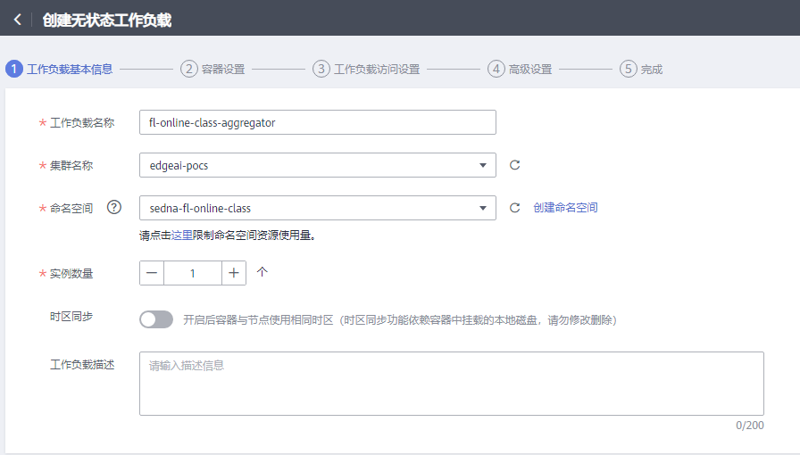
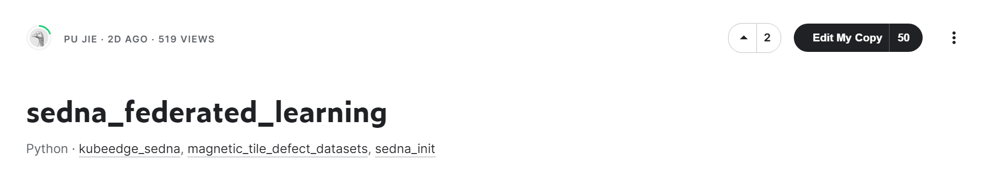

# “在线课程场景”联邦学习

## 整体方案

## 操作步骤

### 前置步骤（老师准备）

####  配置工作负载
这里使用华为云：
* 上传聚合容器镜像


* 配置启动参数

* 配置访问服务

 


#### 2.制作包含Sedna的基础镜像
* 安装基本工具
```
!apt install iputils-ping telnet -y
```

* 安装之后存档到kaggle notebook version
> version6: 安装了telnet、ping工具

* 预装Sedna运行环境


* 配置需要的环境变量 
  * 云上agg worker的ip和配置

### 上课流程（学生操作）

#### 1.学生编写边侧训练代码
基于Sedna编写训练代码
#### 2.学生提交训练任务
等待本地训练完成
查看权重上传
查看云端触发聚合
#### 3.学生查看训练结果
等待云端权重更新到边侧
边侧精度评估

#### 4.重复训练对比效果
